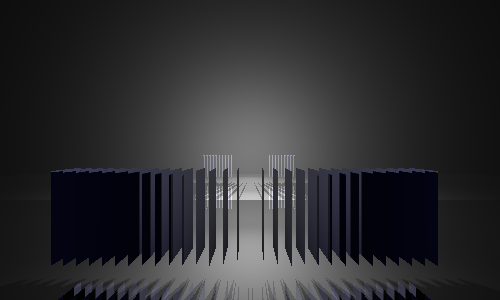
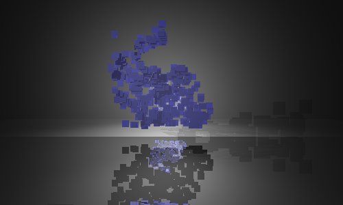

Sometime in June 2016 I decided to revisit raytracers, and to see how much of a
raytracer I could build without looking anything up. `voxel.scm` is a full
recursive raytracer optimized for voxels. It uses the Phong illumination model
(ambient + diffuse + specular). Nothing fancy.

`voxel.scm` contains a homemade BMP encoder, and, with appropriate `load-*`
headers, it should work with any R5RS Scheme implementation. I tested it with
Chicken and Racket, and also with Biwas though Biwas was sadly too slow to be
practical.

This is the kind of thing `voxel.scm` can do very quickly:

It turns out you can find a [CT
scan](http://graphics.stanford.edu/data/voldata/voldata.html#bunny) of the
Stanford Bunny online. This is what you get if you approximate it with a
hundred voxels:

